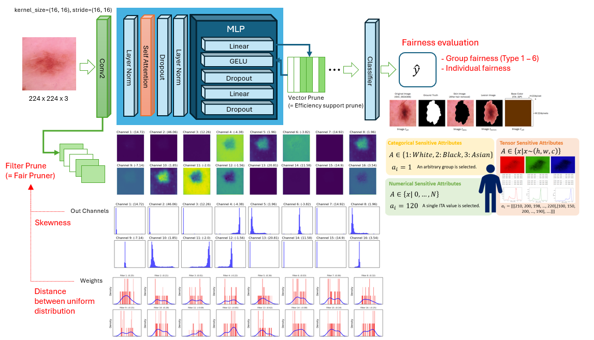

 

# Fairness: Mitigating Skin Colour Bias in Computer Vision Using Prune Learning

In recent years, the accuracy of skin lesion classification models that utilize deep learning has advanced, contributing to the support of doctors' diagnoses and the fair provision of healthcare. However, there is concern that bias due to skin color may affect the diagnosis results, and ensuring fairness has become a challenge. Existing methods for improving fairness have been impractical and burdensome to put into practice due to the difficulty of classifying skin color, the increase in computational resources, and the difficulty of objectively verifying fairness. In this study, to overcome these three challenges, we propose a fairness algorithm for skin lesion classification that is independent of skin color by utilizing pruning learning. We focus on the lesion area by reducing the unnecessary channels related to skin color by calculating the skewness of the feature map in the convolution layer of the Vision Transformer. This reduces the computational load and mitigates the bias caused by skin color. This method does not rely on conventional statistical methods, and it is possible to reduce the model size while ensuring fairness, which promotes practical use.

